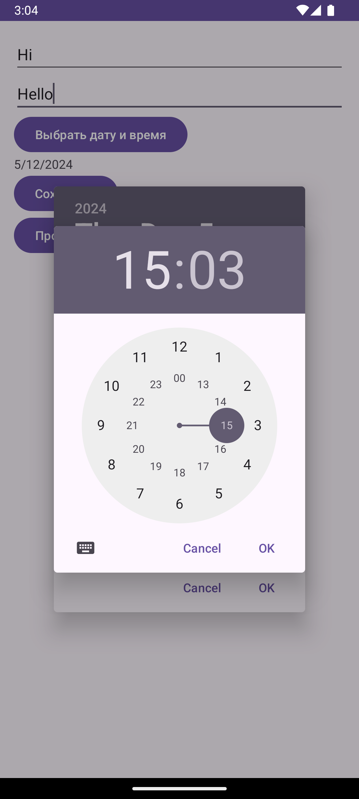

# Лабораторная работа №6: Уведомления
---
Выполнила: **Мызникова Анастасия**  
Язык программирования: **Java**   
База данных: **SQLite**
---
## Описание приложения
Разработала мобильное приложение, позволяющее устанавливать напоминания.   
Создала напоминания и сохранение их в базу данных. В БД хранится следующие значения (Заголовок, Текст уведомления, дата уведомления).   
Имеется возможность просмотра установленных уведомлений и удаление уведомлений.   
Дата напоминания устанавливатся с помощью TimePickerDialog и DatePickerDialog.

---
## Скриншоты

---
# Установка и запуск приложения

Следуйте этим инструкциям, чтобы установить и запустить приложение на своем компьютере.

## Требования

- Установленный [Java JDK](https://www.oracle.com/java/technologies/javase-jdk11-downloads.html) (версия 11 или выше)
- Установленный [Android Studio](https://developer.android.com/studio) (для Android-приложений)

## Установка

1. **Склонируйте репозиторий:**
2. **Перейдите в папку проекта:**
3. **Настройте проект:**
4. **Установите необходимые зависимости:**

## Запуск

1. **Запустите Android-эмулятор или подключите устройство:**
    - Создайте эмулятор в Android Studio через AVD Manager или подключите Android-устройство через USB.

2. **Запустите приложение:**

   Нажмите на кнопку "Run" (Зеленая треугольная кнопка) в Android Studio.